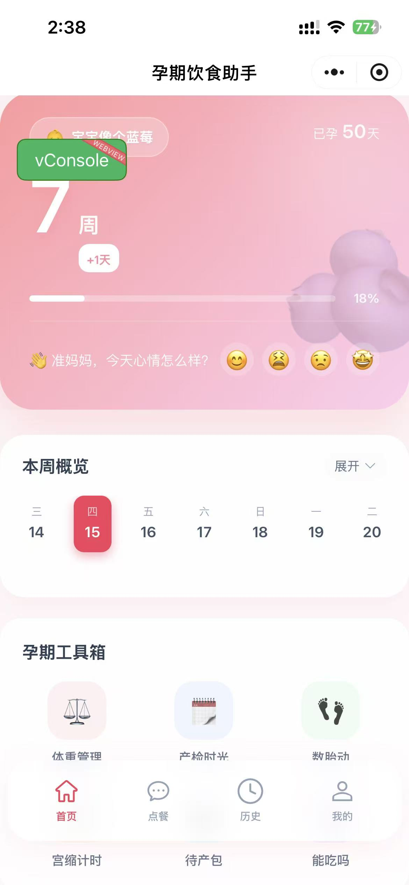
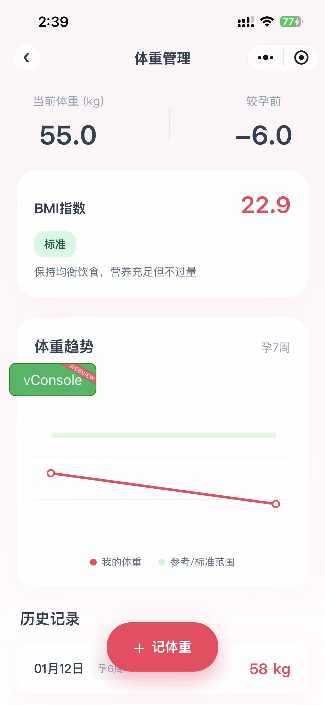
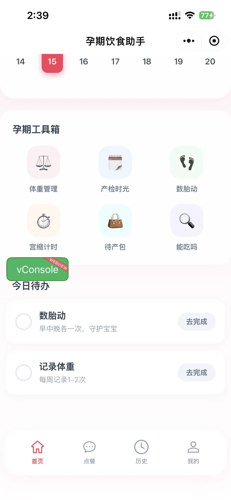

# 孕期饮食助手

<p align="center">
  
</p>

<p align="center">
  <strong>专为孕期女性打造的智能膳食推荐与孕期管理应用</strong>
</p>

<p align="center">
  
  
  
  
</p>

---

## 项目简介

**孕期饮食助手** 是一款基于 AI 技术的跨平台孕期管理应用，为准妈妈提供科学的膳食推荐、体重管理、产检提醒等一站式孕期服务。

### 支持平台

| 平台 | 状态 |
|------|------|
| H5 网页 | ✅ 支持 |
| 微信小程序 | ✅ 支持 |
| 支付宝小程序 | ✅ 支持 |
| 抖音小程序 | ✅ 支持 |
| App (Android/iOS) | ✅ 支持 |

---

## 功能亮点

| 功能 | 描述 |
|------|------|
| **AI 营养师** | 基于孕周的智能饮食推荐，支持 SSE 流式响应，实时生成个性化食谱 |
| **孕期仪表盘** | 实时显示孕周状态、心情互动、每日鼓励语，让孕期充满温暖 |
| **体重管理** | 孕期体重追踪与趋势分析，科学监控体重变化 |
| **产检时光轴** | 产检计划与记录管理，不错过每一次重要检查 |
| **数胎动** | 便捷的胎动计数工具，随时了解宝宝状态 |
| **宫缩计时器** | 精准记录宫缩间隔与持续时间，临产好帮手 |
| **待产包清单** | 待产物品清单管理，轻松准备迎接宝宝 |

---

## 截图展示

<p align="center">
  
  
  
  
</p>

<p align="center">
  <em>从左到右：首页仪表盘、AI 营养师、体重管理、孕期工具</em>
</p>

> 📸 **提示**：截图占位符，请将实际截图放置在 `docs/screenshots/` 目录

---

## 技术栈

| 技术 | 版本 | 说明 |
|------|------|------|
| **uni-app** | 3.0 | 跨平台开发框架 |
| **Vue** | 3.4 | 渐进式 JavaScript 框架 |
| **TypeScript** | 4.9 | JavaScript 超集，类型安全 |
| **Pinia** | 3.0 | Vue 官方状态管理 |
| **uView Plus** | 3.6 | uni-app UI 组件库 |
| **Day.js** | 1.11 | 轻量级时间处理库 |
| **Vue I18n** | 9.1 | 国际化解决方案 |
| **SASS** | 1.97 | CSS 预处理器 |

---

## 快速开始

### 环境要求

- Node.js >= 16
- npm >= 8 (或 pnpm / yarn)
- 微信开发者工具（小程序开发）
- HBuilderX（可选）

### 安装步骤

```bash
# 克隆项目
git clone <repository-url>
cd pregnancy-meal-assistant-client-fe-uniapp

# 安装依赖
npm install

# 启动 H5 开发服务器
npm run dev:h5

# 启动微信小程序开发
npm run dev:mp-weixin
```

### 构建生产版本

```bash
# 构建 H5 版本
npm run build:h5

# 构建微信小程序
npm run build:mp-weixin
```

---

## 目录结构

```
src/
├── api/                # API 请求封装
├── components/         # 公共组件
│   ├── common/         # 通用组件（TabBar、PageContainer）
│   ├── home/           # 首页组件
│   ├── recommend/      # 推荐页组件
│   └── history/        # 历史页组件
├── pages/              # 页面文件
│   ├── index/          # 首页
│   ├── recommend/      # AI 营养师
│   ├── history/        # 历史记录
│   ├── profile/        # 个人中心
│   ├── weight/         # 体重管理
│   ├── care/           # 产检时光轴
│   └── tools/          # 孕期工具
├── services/           # 业务服务层
├── stores/             # Pinia 状态管理
├── types/              # TypeScript 类型定义
├── utils/              # 工具函数
│   ├── request.ts      # 网络请求
│   ├── sse.ts          # SSE 流式响应
│   └── date.ts         # 日期处理
├── static/             # 静态资源
├── App.vue             # 应用入口
└── main.ts             # 主入口文件
```

---

## 常用命令

| 命令 | 说明 |
|------|------|
| `npm run dev:h5` | 启动 H5 开发服务器 |
| `npm run dev:mp-weixin` | 启动微信小程序开发 |
| `npm run dev:mp-alipay` | 启动支付宝小程序开发 |
| `npm run dev:mp-toutiao` | 启动抖音小程序开发 |
| `npm run build:h5` | 构建 H5 生产版本 |
| `npm run build:mp-weixin` | 构建微信小程序生产版本 |
| `npm run type-check` | TypeScript 类型检查 |

---

## 开发说明

### 微信小程序配置

1. 打开 `src/manifest.json`，配置 `mp-weixin.appid`
2. 使用微信开发者工具导入 `dist/dev/mp-weixin` 目录
3. 在微信公众平台配置服务器域名

### 后端服务

本应用需要配套后端服务支持，主要接口包括：

- `/v1/auth/wx/login` - 微信登录
- `/v1/user/info` - 用户信息
- `/v1/user/status` - 孕期状态
- `/v1/user/daily-encouragement` - 每日鼓励

---

## 许可证

本项目基于 [MIT License](LICENSE) 开源。

---

## 免责声明

本应用提供的膳食建议仅供参考，不构成医疗建议。孕期营养管理请遵医嘱，如有健康问题请咨询专业医生。

---

<p align="center">
  Made with ❤️ for expecting mothers
</p>
